# LIVE DEPENDENCY GRAPH (LDG)
## PLMA LAYER 4 — DUBAI MATRIX ASI

> "Cada componente é uma engrenagem que só faz sentido operando em uníssono sob orquestração de Omega."

### GRAPH

```mermaid
graph TD;
    Main[main.py] --> ASIBrain[core.asi_brain.py]
    Main --> MT5Bridge[market.mt5_bridge.py]
    
    ASIBrain -. injected .-> MT5Bridge
    ASIBrain --> DataEngine[market.data_engine.py]
    ASIBrain --> OrderFlowMatrix[market.orderflow_matrix.py]
    ASIBrain --> NeuralSwarm[core.consciousness.neural_swarm.py]
    NeuralSwarm -. parallelizes .-> ThreadPoolExecutor
    ASIBrain --> QuantumThought[core.consciousness.quantum_thought.py]
    ASIBrain --> RegimeDetector[core.consciousness.regime_detector.py]
    ASIBrain --> TrinityCore[core.decision.trinity_core.py]
    ASIBrain --> RiskQuantum[execution.risk_quantum.py]
    ASIBrain --> SniperExecutor[execution.sniper_executor.py]

    ASIBrain --> SentimentScraper[market.scraper.sentiment_scraper.py]
    ASIBrain --> OnChainScraper[market.scraper.onchain_scraper.py]
    ASIBrain --> MacroScraper[market.scraper.macro_scraper.py]
    ASIBrain --> PerformanceTracker[core.evolution.performance_tracker.py]
    ASIBrain --> SelfOptimizer[core.evolution.self_optimizer.py]
    SelfOptimizer --> MutationEngine[core.evolution.mutation_engine.py]
    MutationEngine -. mutates .-> OmegaParams[config.omega_params.py]
    
    NeuralSwarm --> AsynchronousPulseAgent[core.consciousness.agents.asynchronous_pulse_agent.py]
    NeuralSwarm --> MeanFieldGameAgent[core.consciousness.agents.mean_field_game_agent.py]
    NeuralSwarm --> FeynmanPathAgent[core.consciousness.agents.feynman_path_agent.py]
    NeuralSwarm --> QCAAgent[core.consciousness.agents.omega_extreme.py]
    NeuralSwarm --> PredatorPreyAgent[core.consciousness.agents.omega_extreme.py]
    NeuralSwarm --> EVTBlackSwanAgent[core.consciousness.agents.omega_extreme.py]

    CppCore -. accelerates .-> QCAAgent
    CppCore -. accelerates .-> PredatorPreyAgent
    CppCore -. accelerates .-> EVTBlackSwanAgent
    
    DataEngine -. consumes .-> CppCore[LorentzClock]
    QuantumThought -. consumes .-> CppCore[Integrated Information PHI]
```

### HIERARQUIA DE INICIALIZAÇÃO E FLUXO DE DADOS:
1. `main.py` levanta `MT5Bridge` na API Python e tenta engatar socket na porta `5555`.
2. Após o fluxo ser validado com pongs de `bid` e `ask`, `main.py` invoca `ASIBrain`.
3. `ASIBrain` instancia o `DataEngine`, acionando assincronamente a Thread `_background_worker`.
4. `ASIBrain` inicia os 3 Scrapers (Sentiment, OnChain, Macro) em threads background.
5. Os snapshots `MarketSnapshot` coletados vão decodificando Order Flow (`OrderFlowMatrix`), detecção de dilatação temporal (`LorentzClock`) e envia ao `RegimeDetector`.
6. Scrapers injetam `sentiment_score`, `network_pressure` e `macro_bias` no snapshot metadata.
7. Enxame de neurônios gera inferência probabilística (incluindo agentes Ω-Extreme) concorrentemente (ThreadPool).
8. O Sinal Quântico alcança a Camada Abstrata `QuantumThoughtEngine` para colapso de sinais e cálculo de `Φ (PHI)`.
9. Se `Φ` > threshold, a decisão alcança a Cúpula Executiva `TrinityCore` para veredictos.
10. Decisão acatada passa para avaliação do passaporte `RiskQuantumEngine`.
11. `SniperExecutor` materializa a ordem no MT5.
12. A cada 200 ciclos, `SelfOptimizer` avalia performance e orquestra mutações nos `OmegaParams`.

*(Atualizado: 2026-03-07. Versão: 12.0.0-omega+extreme — Phase Ω-Extreme Victory)*
