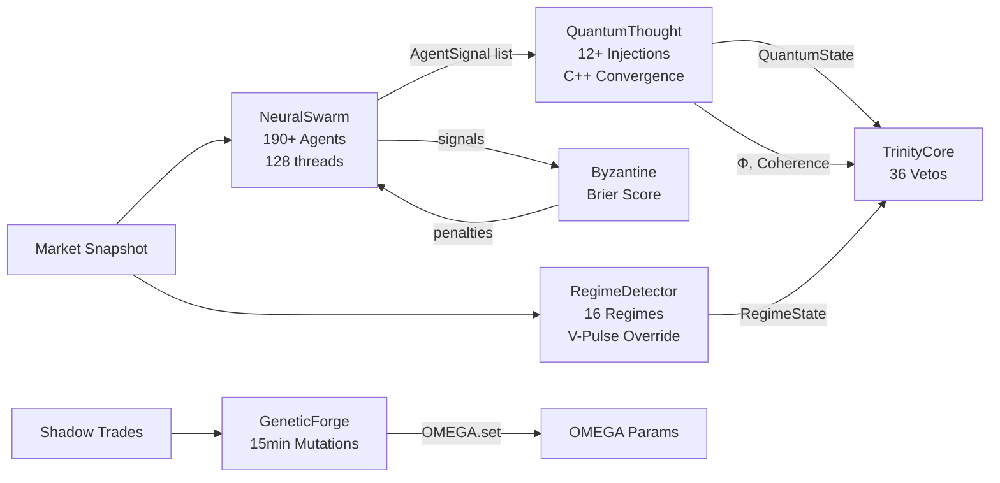

# 🧬 DubaiMatrixASI — Relatório PhD (Fase 5: Consciousness Layer)

## Phase 5: Consciousness Layer (6 Subsistemas, ~2800 linhas)

### Arquitetura de Fluxo de Dados

---

### 1. NeuralSwarm ([neural_swarm.py](file:///d:/DubaiMatrixASI/core/consciousness/neural_swarm.py), 782 linhas)

**Função:** Orquestra 190+ agentes analíticos em paralelo via `ThreadPoolExecutor(max_workers=128)`.

| Métricas | Valor |
|:--|:--|
| Agentes instanciados | ~195 |
| Import phases | 35+ |
| Thread pool size | 128 |
| Execution timeout | 2.5s |

**Pesos por tier (range):**
- Classic: 0.6 – 1.2
- Predator/SMC: 1.4 – 2.2
- Physics/Chaos: 1.4 – 1.9
- Transcendence: 2.5 – 3.5
- PhD: 4.0 – 5.5 (peso mais alto: `QuantumDirectionalInferenceAgent = 5.5`)

> [!CAUTION]
> **Duplicações Críticas de Agentes** — Os seguintes agentes são instanciados **2-3x**, distorcendo os pesos do enxame:
> - `OrderBookSpoofingAgent(2.6)` — L434, L545, L670 = **3 instâncias**
> - `QuantumEntanglementAgent(3.0)` — L435, L546, L671 = **3 instâncias**
> - `OrderFlowShannonSentimentAgent` — L436, L672 = **2 instâncias**
> - `HiddenMarkovRegimeAgent(3.8)` — L439, L591 = **2 instâncias**
> - `FractalStandardDeviationAgent(3.5)` — L440, L592 = **2 instâncias**
> - `DarkEnergyMomentumAgent(4.0)` — L441, L593 = **2 instâncias**
> - `InformationBottleneckAgent(4.5)` — L624, L625 = **2 instâncias consecutivas (!)** (provável typo)
> - `RiemannianRicciAgent`, `KolmogorovInertiaAgent`, `LieSymmetryAgent`, `GhostOrderInferenceAgent` — imports duplicados (L168-171 e L190-193)

**Impacto:** Agentes duplicados recebem 2-3x mais voto no colapso quântico, enviesando sistematicamente a decisão.

---

### 2. QuantumThought ([quantum_thought.py](file:///d:/DubaiMatrixASI/core/consciousness/quantum_thought.py), 699 linhas)

**Função:** Transforma sinais dos agentes em `QuantumState` via interferência construtiva/destrutiva.

**Pipeline de Injeções OMEGA (antes do colapso):**

| # | Injection | Efeito |
|:--|:--|:--|
| 1 | Structural Entanglement | Crush 75% peso de momentum se estrutura oposta |
| 2 | Cluster Entropy Mapping | Institucional coerente → 2.5x boost |
| 3 | Freight Train Override | Momentum > 0.85 → suporte/resistência virão vidro |
| 4 | SMC Trap Veto | Smart Money convergiu → crush 95% do retail |
| 5 | Ricci Attractor | Riemannian Ricci > 0.7 → 2x boost alinhados, 0.1x opostos |
| 6 | Kolmogorov Sync | Fluxo programático → 2.5x boost em agentes algo |
| 7 | V-Pulse Lock | Ignição → 5x boost nos agentes de ignição, 0.001x opostos |
| 8 | Kinematic Divergence | Momentum sem estrutura → dampened |
| 9 | Elastic Snapback | Reversão estrutural → 0.1x momentum contrário |
| 10 | Dead Cat Bounce | Macro trend vs micro bounce → crush micro |
| 11 | Sentiment Rebalancing | Extreme Fear/Greed → rebalanceia agentes |
| 12 | Leading-Lagging Sovereignty | Leading diverge → 3x leader, 0.2x lagging |

**Convergência** → delegada ao `CPP_CORE.converge_signals()` (C++) → calcula signal, coherence, entropy → `CPP_CORE.calculate_phi()` para Φ (consciência integrada).

**Superposition Resolution:** 3 métodos: Institutional Override, Regime-Anchored, Temporal Tunneling.

---

### 3. Monte Carlo Engine ([monte_carlo_engine.py](file:///d:/DubaiMatrixASI/core/consciousness/monte_carlo_engine.py), 708 linhas)

**Função:** 5000 simulações Merton Jump-Diffusion + 4096D Hyperspace via C++.

- **Modelo:** GBM + Poisson Jump com parâmetros regime-aware
- **Output:** `MonteCarloResult` (WinProb, EV, VaR95, CVaR95, Sharpe, Skew, Kurtosis, optimal SL/TP, MC Score)
- **Score:** `0.5×WP + 0.3×EV + 0.2×TailPenalty + BalanceBonus + HyperspaceBoost`
- **Stress Test:** Flash Crash (5x vol), Squeeze (3x), Dead Market (0.1x), Black Swan (8x)
- **Grid Search:** Optimiza SL/TP sobre paths simulados (desabilitado quando C++ offload)

> [!WARNING]
> `REGIME_PARAMS` contém apenas 8 regimes, mas `RegimeDetector` define **16 regimes**. Regimes como `CREEPING_BULL`, `DRIFTING_BEAR`, `LIQUIDITY_HUNT`, `PARADIGM_SHIFT`, etc. caem no fallback `RANGING`, distorcendo drasticamente a simulação para esses regimes.

---

### 4. Regime Detector ([regime_detector.py](file:///d:/DubaiMatrixASI/core/consciousness/regime_detector.py), 429 linhas)

**Função:** Classifica mercado em 16 regimes + prevê transições.

**Features:** Hurst, ATR%, BB Width, Fractal Dim, EMA alignment, Volume Ratio, Shannon Entropy.

**V-Pulse Override:** Detecta HFT acceleration, V-shape recovery, e explosões via M1 candles — pode sobrescrever regime M5.

---

### 5. Byzantine Consensus ([byzantine_consensus.py](file:///d:/DubaiMatrixASI/core/consciousness/byzantine_consensus.py), 68 linhas)

**Função:** Penaliza agentes "traidores" via Brier Score retroativo (EMA α=0.15).

Conciso e bem implementado. Recovery boost de +0.01 por ciclo para agentes que melhoraram.

---

### 6. Genetic Forge ([genetic_forge.py](file:///d:/DubaiMatrixASI/core/consciousness/genetic_forge.py), 122 linhas)

**Função:** Thread daemon que a cada 15min avalia performance e muta OMEGA params.

> [!WARNING]
> **Bug:** Na L61, carrega `json.load(f).get("ghosts", [])` mas `shadow_trades.json` é um **array puro** (não um dict com chave "ghosts"). O `.get("ghosts", [])` SEMPRE retorna `[]`, tornando o feedback de Shadow Trades **completamente nulo**. A Forja Genética **NUNCA** lê os shadows.

**Mutação aleatória:** 25% de chance de micro-mutação no `weight_spoof_hunter` com delta [-0.3, +0.3] — pode gerar drift estocástico indesejado.

---

## 🔴 Bugs Consolidados (Fase 5)

| # | Sev. | Descrição | Local |
|:--|:--|:--|:--|
| 1 | 🔴 CRITICAL | **10+ agentes duplicados** no swarm (3x OrderBookSpoofingAgent, 3x QuantumEntanglementAgent, etc.) | [neural_swarm.py:434-672](file:///d:/DubaiMatrixASI/core/consciousness/neural_swarm.py#L434) |
| 2 | 🔴 CRITICAL | `InformationBottleneckAgent` instanciado **2x consecutivas** (L624-625) — provável typo | [neural_swarm.py:624-625](file:///d:/DubaiMatrixASI/core/consciousness/neural_swarm.py#L624) |
| 3 | 🟡 MEDIUM | Monte Carlo `REGIME_PARAMS` incompleto (8/16 regimes) — fallback `RANGING` distorce simulações | [monte_carlo_engine.py:100-109](file:///d:/DubaiMatrixASI/core/consciousness/monte_carlo_engine.py#L100) |
| 4 | 🔴 CRITICAL | GeneticForge lê `.get("ghosts", [])` mas JSON é array puro → shadows **NUNCA lidos** | [genetic_forge.py:61](file:///d:/DubaiMatrixASI/core/consciousness/genetic_forge.py#L61) |
| 5 | 🟢 LOW | Imports duplicados nas linhas 168-171 e 190-193 (RiemannianRicciAgent, etc.) | [neural_swarm.py:168-193](file:///d:/DubaiMatrixASI/core/consciousness/neural_swarm.py#L168) |

---

> **📊 Status**: Fase 5 completa. Próximo: Fase 6 (Agent Swarm — 81+ arquivos de agentes).
