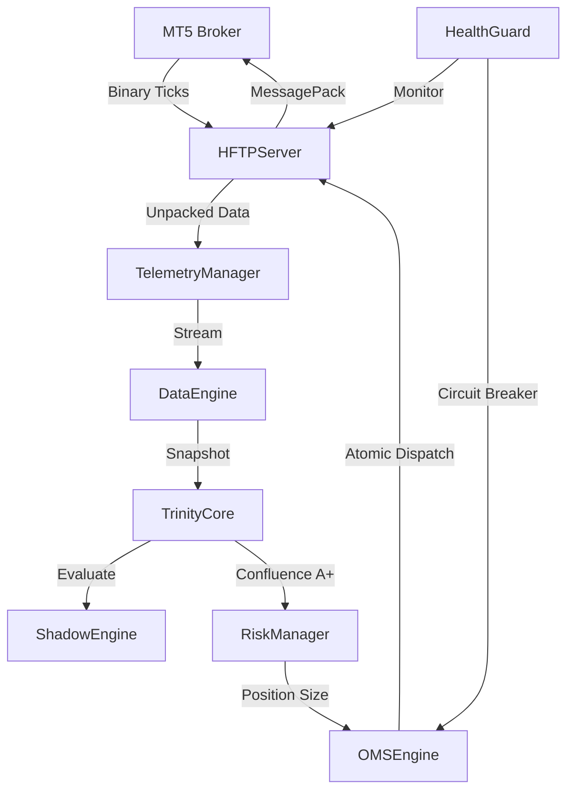

# 💎 SOLÉNN — ARCHITECTURAL SOVEREIGN DICTIONARY (ASD)
## 📐 ESTRUTURA RECURSIVA DE DIRETÓRIOS Ω

Este documento descreve a topologia cognitiva e técnica da SOLÉNN Ω. Cada pasta é um "órgão funcional" no sistema vivo, projetado para desacoplar a percepção da decisão e a execução do risco.

---

### 1. `/core/` (O Sistema Nervoso Central)
A espinha dorsal da SOLÉNN. Onde a lógica bruta se torna inteligência soberana.
-   `decision/`: **A Trindade (Brain)**. Onde Tesla, Einstein e Soros convergem. Implementa o `TrinityCore` e o `ShadowEngine` de auditoria contrafactual.
    *   *Função*: Filtragem de hiperconfluência (veto absoluto).
-   `intelligence/`: **Conectividade (HFT-P Bridge)**. Onde a SOLÉNN se conecta ao mundo MetaTrader 5.
    *   *Função*: Protocolo binário MessagePack, gestão atômica de ordens e sentinela de resiliência.
-   `risk/`: **Antifragilidade (Sizing)**. Onde o capital é isolado da incerteza.
    *   *Função*: Dimensionamento de Kelly-Bayesian e CVaR (Conditional Value at Risk).

### 2. `/market/` (Percepção Cortex)
O sistema sensorial. Transforma o caos do mercado em uma estrutura geométrica coerente.
-   `indicators/`: **Biometria Financeira**. Decomposição multifractal e física de 4ª ordem (Jounce).
-   `models/`: **Redes Neurais & Probabilidade**. HMM (Hidden Markov Models) e VAEs (Variational Autoencoders) para detecção de regime.

### 3. `/dictionaries/` (Sovereign SED)
O repositório de conhecimento. Onde o "Por Quê" é imortalizado (Lei II).
-   *Função*: Armazenar os tratados científicos que justificam cada linha de código v2, eliminando a amnésia sistêmica.

### 4. `/tests/` (Neural Verification)
O tribunal da perfeição. Onde cada vetor é desafiado antes da integração.
-   `unit/`: Testes atômicos de vitalidade modular.
-   `integration/`: Simulação de canais de fluxo de dados reais.

### 5. `/.agents/` (A Alma do Organismo)
Contém as regras de existência e os protocolos de comunicação ASI-Grade.
-   `rules/`: As Leis Absolutas que governam cada decisão da IA.

---

### 🔱 MAPA DE FLUXO Ω

"A estrutura é o destino. O caos é apenas uma arquitetura ainda não compreendida."
